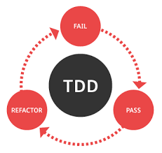

 

  <h3 align="center">TESTING PRACTICE</h3>

  

    JavaScript Project
     
     
    <a href="https://www.freecodecamp.org/news/a-quick-introduction-to-test-driven-development-with-jest-cac71cb94e50/">TDD basics</a>
    ·
    <a href="https://github.com/samgaco/testsjs/issues">Report Bug</a>
    ·
    <a href="https://github.com/samgaco/testsjs/issues">Request Feature</a>
  

<!-- TABLE OF CONTENTS -->
## Table of Contents

* [About the Project](#about-the-project)
  * [Built With](#built-with)
* [Contact](#Contact)

<!-- ABOUT THE PROJECT -->
## About The Project

Based on the [TESTING PRACTICE](https://www.theodinproject.com/courses/javascript/lessons/testing-practice) in the odin project as a part of the Microverse curriculum.

The purpose of the project is to get a great intoduction to Test Driven Development in [Jest](https://jestjs.io/docs/en/getting-started.html#content) test-running system has been used to test various methods.

### Built With
* [JavaScript](https://www.javascript.com/)
* [webpack](https://webpack.js.org/)
* [Jest](https://jestjs.io/docs/en/getting-started)

### Contact

* [Simon Wathigo](https://github.com/wathigo) - wathigosimon@gmail.com - [Linkedin](https://www.linkedin.com/in/simon-wathigo-445370183/)
* [Samuel García Companys](https://github.com/samgaco) - samuelgarciacompanys@gmail.com - [Linkedin](https://www.linkedin.com/in/samuel-garc%C3%ADa-companys-0a848284/)
